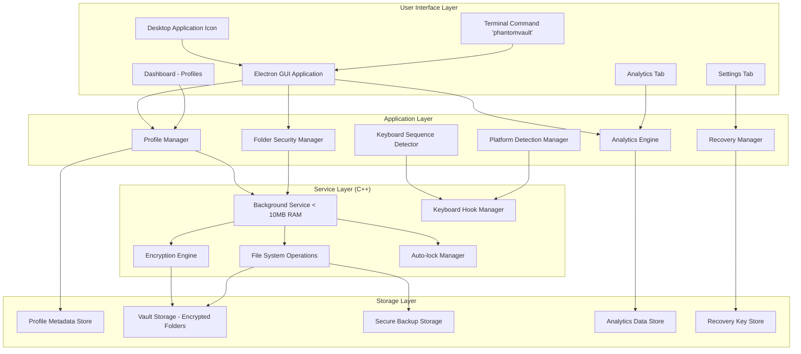

# Design Document

## Overview

PhantomVault is a comprehensive folder security application designed with a clean, modern architecture that provides invisible folder locking, profile-based management, and seamless keyboard sequence detection. The system is built with performance in mind (< 10MB RAM usage) and provides complete folder security through encryption, hiding, and secure backup mechanisms.

The architecture follows a service-oriented design with a lightweight C++ background service for core operations and an Electron-based GUI for user interaction, ensuring both performance and user experience.

## Architecture

### High-Level Architecture



### Component Architecture

The system is designed with clear separation of concerns:

1. **GUI Layer (Electron + React)**: Modern, beautiful interface with dashboard, analytics, and settings
2. **Service Layer (C++)**: Lightweight background service handling core security operations
3. **Storage Layer**: Encrypted, secure storage with backup mechanisms
4. **Platform Integration**: OS-specific keyboard detection and notification systems

## Components and Interfaces

### 1. Profile Manager

**Responsibilities:**
- Profile creation and management (admin-only)
- Master key authentication and validation
- Recovery key generation and management
- Profile switching and session management

**Key Methods:**
```cpp
class ProfileManager {
public:
    // Profile lifecycle
    ProfileResult createProfile(const std::string& name, const std::string& masterKey);
    std::vector<Profile> getAllProfiles();
    AuthResult authenticateProfile(const std::string& profileId, const std::string& masterKey);
    bool changeProfilePassword(const std::string& profileId, const std::string& oldKey, const std::string& newKey);
    
    // Session management
    void setActiveProfile(const std::string& profileId);
    std::optional<Profile> getActiveProfile();
    void clearActiveProfile();
    
    // Admin operations
    bool isRunningAsAdmin();
    bool requiresAdminForProfileCreation();
};
```

### 2. Folder Security Manager

**Responsibilities:**
- Folder locking, encryption, and hiding
- Secure folder storage and backup management
- Temporary and permanent unlock operations
- Complete trace removal from original locations

**Key Methods:**
```cpp
class FolderSecurityManager {
public:
    // Folder operations
    LockResult lockFolder(const std::string& profileId, const std::string& folderPath);
    UnlockResult unlockFolderTemporary(const std::string& profileId, const std::string& folderId);
    UnlockResult unlockFolderPermanent(const std::string& profileId, const std::string& folderId);
    bool lockTemporaryFolders(const std::string& profileId);
    
    // Folder management
    std::vector<SecuredFolder> getProfileFolders(const std::string& profileId);
    bool removeFromProfile(const std::string& profileId, const std::string& folderId);
    
    // Security operations
    bool createSecureBackup(const std::string& folderId);
    bool removeAllTraces(const std::string& originalPath);
    bool validateFolderIntegrity(const std::string& folderId);
};
```

### 3. Keyboard Sequence Detector

**Responsibilities:**
- Ctrl+Alt+V hotkey detection
- Keyboard logging and pattern matching
- Platform-specific input handling
- Password extraction from user input

**Key Methods:**
```cpp
class KeyboardSequenceDetector {
public:
    // Sequence detection
    void startSequenceDetection();
    void stopSequenceDetection();
    bool isDetectionActive();
    
    // Pattern matching
    std::optional<std::string> extractPasswordPattern(const std::string& input);
    std::vector<std::string> findAllPatterns(const std::string& input);
    
    // Platform integration
    bool supportsInvisibleLogging();
    void showPasswordPrompt();
    void showNotificationPrompt();
    
    // Callbacks
    void setOnPasswordDetected(std::function<void(const std::string&)> callback);
    void setOnSequenceTimeout(std::function<void()> callback);
};
```

### 4. Platform Detection Manager

**Responsibilities:**
- Operating system and environment detection
- Keyboard logging capability assessment
- Platform-specific guidance and adaptation
- Unlock method selection and configuration

**Key Methods:**
```cpp
class PlatformDetectionManager {
public:
    enum class Platform { LINUX_X11, LINUX_WAYLAND, MACOS, WINDOWS, UNKNOWN };
    enum class UnlockMethod { INVISIBLE_LOGGING, NOTIFICATION_PROMPT, LEFT_CLICK, MANUAL_INPUT };
    
    Platform detectPlatform();
    std::vector<UnlockMethod> getSupportedUnlockMethods();
    UnlockMethod getRecommendedUnlockMethod();
    std::string getPlatformGuidance();
    
    // Configuration
    void setPreferredUnlockMethod(UnlockMethod method);
    UnlockMethod getPreferredUnlockMethod();
};
```

### 5. Analytics Engine

**Responsibilities:**
- Usage tracking and statistics collection
- Access pattern analysis
- Security event logging
- Performance metrics and reporting

**Key Methods:**
```cpp
class AnalyticsEngine {
public:
    // Event tracking
    void recordUnlockAttempt(const std::string& profileId, bool successful);
    void recordFolderAccess(const std::string& profileId, const std::string& folderId);
    void recordSecurityEvent(const std::string& eventType, const std::string& details);
    
    // Analytics retrieval
    ProfileAnalytics getProfileAnalytics(const std::string& profileId, TimeRange range);
    SystemAnalytics getSystemAnalytics(TimeRange range);
    std::vector<SecurityEvent> getSecurityEvents(TimeRange range);
    
    // Reporting
    AnalyticsReport generateDailyReport(const std::string& profileId);
    AnalyticsReport generateWeeklyReport(const std::string& profileId);
};
```

### 6. GUI Application (React/TypeScript)

**Responsibilities:**
- Modern, beautiful user interface
- Profile management and authentication
- Folder operations and status display
- Analytics visualization and settings management

**Key Components:**
```typescript
// Main Application Structure
interface PhantomVaultApp {
    dashboard: DashboardComponent;
    analytics: AnalyticsComponent;
    settings: SettingsComponent;
    clock: ClockComponent;
    themeManager: ThemeManager;
}

// Dashboard Component
interface DashboardComponent {
    profileList: ProfileListComponent;
    profileCreation: ProfileCreationDialog;
    folderManager: FolderManagerComponent;
    quickActions: QuickActionsPanel;
}

// Analytics Component
interface AnalyticsComponent {
    usageCharts: UsageChartsComponent;
    accessHistory: AccessHistoryComponent;
    securityEvents: SecurityEventsComponent;
    profileComparison: ProfileComparisonComponent;
}

// Settings Component
interface SettingsComponent {
    recoveryInterface: RecoveryKeyInterface;
    themeSettings: ThemeSettingsComponent;
    unlockMethodSettings: UnlockMethodSettings;
    helpAndGuidance: HelpComponent;
}
```

## Data Models

### Profile Data Structure

```cpp
struct Profile {
    std::string id;
    std::string name;
    std::chrono::system_clock::time_point createdAt;
    std::chrono::system_clock::time_point lastAccess;
    
    // Security (encrypted/hashed)
    std::string masterKeyHash;
    std::string encryptedRecoveryKey;
    std::string salt;
    
    // State
    bool isActive;
    size_t folderCount;
};
```

### Secured Folder Data Structure

```cpp
struct SecuredFolder {
    std::string id;
    std::string profileId;
    std::string originalPath;
    std::string originalName;
    std::string vaultPath;
    std::string backupPath;
    
    // Status
    bool isLocked;
    bool isTemporarilyUnlocked;
    std::chrono::system_clock::time_point lockedAt;
    std::chrono::system_clock::time_point lastAccess;
    
    // Security
    std::string encryptionKey;
    std::string integrityHash;
    size_t originalSize;
};
```

### Analytics Data Structure

```cpp
struct ProfileAnalytics {
    std::string profileId;
    std::string profileName;
    
    // Usage statistics
    uint32_t totalUnlockAttempts;
    uint32_t successfulUnlocks;
    uint32_t failedUnlocks;
    uint32_t foldersAccessed;
    
    // Time-based data
    std::vector<DailyUsage> dailyUsage;
    std::chrono::system_clock::time_point lastActivity;
    std::chrono::duration<double> averageSessionTime;
};
```

### Storage Structure

```
~/.phantomvault/
├── profiles/
│   ├── profiles.json              # All profiles metadata
│   └── {profile_id}/
│       ├── folders.json           # Profile folder metadata
│       └── analytics.json         # Profile analytics data
├── vault/
│   └── {profile_id}/
│       └── {folder_id}/           # Encrypted folder storage
│           ├── content.enc        # Encrypted folder content
│           ├── metadata.enc       # Encrypted folder metadata
│           └── integrity.hash     # Integrity verification
├── backups/
│   └── {profile_id}/
│       └── {folder_id}/           # Secure backup storage
│           ├── backup_1.enc       # Primary backup
│           ├── backup_2.enc       # Secondary backup
│           └── recovery.info      # Recovery information
└── system/
    ├── config.json                # System configuration
    ├── platform.json              # Platform detection cache
    └── analytics.json             # System-wide analytics
```

## Error Handling

### Security-First Error Handling

1. **Profile Operations**
   - Authentication failures with attempt limiting
   - Profile creation errors with secure cleanup
   - Password change failures with rollback
   - Recovery key validation with secure logging

2. **Folder Security Operations**
   - Encryption failures with secure cleanup
   - File system errors with backup recovery
   - Integrity check failures with alert system
   - Unlock failures with security logging

3. **Platform Integration**
   - Keyboard detection failures with fallback methods
   - Permission errors with user guidance
   - Service communication failures with retry logic
   - Platform compatibility issues with adaptation

### Recovery Strategies

1. **Atomic Operations**: All critical operations are atomic with rollback capability
2. **Secure Backups**: Multiple backup layers for critical data recovery
3. **Graceful Degradation**: Fallback methods when primary features are unavailable
4. **User Guidance**: Clear error messages with actionable recovery steps

## Testing Strategy

### Security Testing

1. **Encryption Validation**
   - Strong encryption algorithm verification
   - Key derivation and storage security
   - Integrity check validation
   - Secure deletion verification

2. **Profile Isolation**
   - Cross-profile access prevention
   - Authentication boundary testing
   - Session management security
   - Recovery key protection

3. **Trace Removal**
   - Original location cleanup verification
   - Metadata scrubbing validation
   - Forensic analysis resistance
   - Secure backup protection

### Performance Testing

1. **Resource Usage**
   - RAM usage under 10MB verification
   - CPU usage optimization
   - Battery usage minimization
   - Startup time optimization

2. **Scalability Testing**
   - Multiple profile performance
   - Large folder handling
   - Concurrent operation testing
   - Long-term usage stability

### Platform Testing

1. **Cross-Platform Compatibility**
   - Linux (X11/Wayland) testing
   - macOS compatibility verification
   - Windows platform testing
   - Platform-specific feature validation

2. **Integration Testing**
   - Keyboard detection accuracy
   - Service-GUI communication
   - File system integration
   - Notification system testing

## Implementation Phases

### Phase 1: Core Infrastructure (Weeks 1-2)
- Basic project structure and build system
- Core C++ service with profile management
- Basic encryption and file operations
- Simple GUI framework setup

### Phase 2: Profile System (Weeks 3-4)
- Complete profile management implementation
- Master key authentication system
- Recovery key generation and validation
- Admin privilege detection and enforcement

### Phase 3: Folder Security (Weeks 5-6)
- Folder locking and encryption implementation
- Secure storage and backup systems
- Trace removal and cleanup mechanisms
- Integrity checking and validation

### Phase 4: Keyboard Detection (Weeks 7-8)
- Platform detection and capability assessment
- Keyboard sequence detection implementation
- Pattern matching and password extraction
- Platform-specific unlock methods

### Phase 5: GUI Development (Weeks 9-10)
- Modern dashboard with profile management
- Analytics visualization and reporting
- Settings interface with recovery system
- Theme support and user experience polish

### Phase 6: Analytics and Polish (Weeks 11-12)
- Usage tracking and analytics engine
- Performance optimization and testing
- Security audit and validation
- Documentation and user guides

## Security Considerations

### Encryption and Key Management
- AES-256 encryption for all folder content
- PBKDF2 key derivation with high iteration counts
- Secure random number generation for salts and keys
- Memory protection for sensitive data handling

### Profile Security
- Bcrypt password hashing with salt
- Secure recovery key generation and storage
- Session timeout and automatic locking
- Authentication attempt limiting and logging

### System Security
- Privilege separation between GUI and service
- Secure IPC communication channels
- File system permission hardening
- Secure deletion of temporary files

### Privacy Protection
- No plaintext metadata storage
- Encrypted analytics data collection
- Secure logging with sensitive data filtering
- User consent for data collection and usage

## Performance Optimization

### Memory Management
- Efficient C++ service with minimal footprint
- Smart pointer usage for automatic cleanup
- Memory pool allocation for frequent operations
- Lazy loading of non-critical components

### CPU Optimization
- Asynchronous operations for I/O intensive tasks
- Efficient encryption algorithms and implementations
- Optimized file system operations
- Background processing for non-urgent tasks

### Battery Optimization
- Event-driven architecture to minimize polling
- Efficient keyboard detection with minimal overhead
- Smart scheduling of background operations
- Power-aware operation modes

## Installation and Deployment

### Installer Design
- Single executable installer for easy distribution
- Automatic service installation and startup
- Desktop integration with application icons
- Terminal command registration

### Service Management
- Automatic service startup on system boot
- Service health monitoring and recovery
- Graceful shutdown and cleanup procedures
- Update mechanism for seamless upgrades

### Cross-Platform Distribution
- Platform-specific installers (deb, rpm, dmg, msi)
- Dependency management and bundling
- Digital signing for security verification
- Automatic update notification system