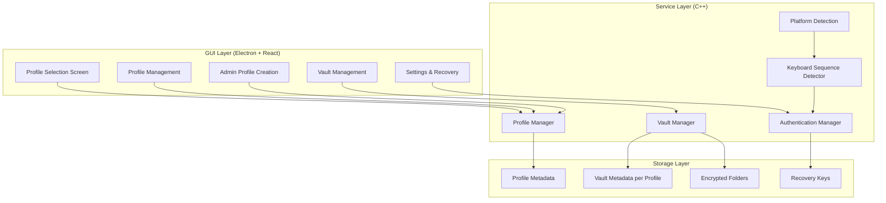

# Design Document

## Overview

This design document outlines the architectural changes required to transform PhantomVault from a single-user vault system to a multi-profile system. The new architecture will support multiple independent profiles, each with separate master keys, recovery keys, and folder management, while maintaining the invisible keyboard sequence detection for unlocking.

The design addresses the complete separation of concerns between profiles, admin-only profile creation, and platform-specific keyboard input handling.

## Architecture

### High-Level Architecture



### Component Separation

The system will be restructured with clear separation between:

1. **Profile Management**: Handles profile creation, selection, and authentication
2. **Vault Management**: Manages folders within the context of a specific profile
3. **Authentication**: Handles master key verification and recovery key operations
4. **Platform Integration**: Manages keyboard sequence detection based on platform capabilities

## Components and Interfaces

### 1. Profile Manager (C++ Service)

**Responsibilities:**
- Profile creation (admin-only)
- Profile selection and authentication
- Master key management per profile
- Recovery key generation and storage

**Key Methods:**
```cpp
class ProfileManager {
public:
    // Profile lifecycle
    std::shared_ptr<Profile> createProfile(const std::string& name, 
                                         const std::string& masterKey, 
                                         const std::string& recoveryKey);
    std::vector<Profile> getAllProfiles();
    bool setActiveProfile(const std::string& profileId, const std::string& masterKey);
    std::shared_ptr<Profile> getActiveProfile();
    
    // Authentication
    bool verifyMasterKey(const std::string& profileId, const std::string& masterKey);
    std::string recoverMasterKey(const std::string& profileId, const std::string& recoveryKey);
    
    // Admin operations
    bool isRunningAsAdmin();
    bool requiresAdminForProfileCreation();
};
```

### 2. Vault Manager (C++ Service)

**Responsibilities:**
- Folder management within profile context
- Encryption/decryption operations
- Temporary vs permanent unlock tracking
- Profile-scoped folder operations

**Key Methods:**
```cpp
class VaultManager {
public:
    // Folder operations (profile-scoped)
    bool addFolder(const std::string& profileId, const std::string& folderPath, 
                   const std::string& masterKey);
    std::vector<VaultFolder> getFolders(const std::string& profileId);
    bool removeFolder(const std::string& profileId, const std::string& folderId);
    
    // Unlock operations
    UnlockResult unlockFolders(const std::string& profileId, const std::string& masterKey, 
                              UnlockMode mode);
    bool lockTemporaryFolders(const std::string& profileId);
    
    // Profile isolation
    void switchProfileContext(const std::string& profileId);
    void clearProfileContext();
};
```

### 3. Authentication Manager (C++ Service)

**Responsibilities:**
- Master key verification across profiles
- Recovery key operations
- Password pattern detection from keyboard input
- Profile-specific authentication state

**Key Methods:**
```cpp
class AuthenticationManager {
public:
    // Pattern detection
    bool detectAuthenticationPattern(const std::string& input, 
                                   std::string& extractedPassword, 
                                   UnlockMode& mode);
    
    // Multi-profile authentication
    std::optional<std::string> authenticateAnyProfile(const std::string& password);
    bool authenticateProfile(const std::string& profileId, const std::string& password);
    
    // Recovery operations
    std::string recoverWithKey(const std::string& recoveryKey);
};
```

### 4. Platform Detection Manager (C++ Service)

**Responsibilities:**
- Detect current platform capabilities
- Determine keyboard logging support
- Provide platform-specific guidance

**Key Methods:**
```cpp
class PlatformManager {
public:
    enum class PlatformType { X11, WAYLAND, MACOS, WINDOWS, UNKNOWN };
    enum class KeyboardSupport { INVISIBLE_LOGGING, EXPLICIT_INPUT, UNSUPPORTED };
    
    PlatformType detectPlatform();
    KeyboardSupport getKeyboardSupport();
    std::string getPlatformGuidance();
    bool supportsInvisibleLogging();
};
```

### 5. GUI Profile Interface (React/TypeScript)

**Responsibilities:**
- Profile selection and switching
- Admin-mode profile creation
- Master key input and verification
- Recovery key display and input

**Key Components:**
```typescript
interface ProfileSelectionScreen {
    profiles: Profile[];
    onProfileSelect: (profileId: string, masterKey: string) => void;
    onCreateProfile: () => void; // Only visible in admin mode
    isAdminMode: boolean;
}

interface ProfileCreationDialog {
    onCreateProfile: (name: string, masterKey: string, recoveryKey: string) => void;
    onCancel: () => void;
    recoveryKey: string; // Generated and displayed once
}

interface RecoveryInterface {
    onRecoveryKeySubmit: (recoveryKey: string) => void;
    onMasterKeyRetrieved: (masterKey: string) => void;
}
```

## Data Models

### Profile Data Structure

```cpp
struct Profile {
    std::string id;
    std::string name;
    std::string osUser;
    std::chrono::system_clock::time_point createdAt;
    std::chrono::system_clock::time_point lastAccess;
    
    // Security (encrypted/hashed)
    std::string masterPasswordHash;
    std::string encryptedRecoveryKey;
    
    // State
    bool isActive;
};
```

### Vault Folder Data Structure

```cpp
struct VaultFolder {
    std::string id;
    std::string profileId; // Profile association
    std::string folderName;
    std::string originalPath;
    std::string vaultPath;
    bool isLocked;
    UnlockMode unlockMode;
    std::chrono::system_clock::time_point createdAt;
    std::chrono::system_clock::time_point lastAccess;
};
```

### Storage Structure

```
~/.phantom_vault_storage/
├── {username}/
│   ├── metadata/
│   │   ├── profiles.json          # All profiles metadata
│   │   └── {profile_id}/
│   │       └── folders_metadata.json  # Profile-specific folders
│   ├── vaults/
│   │   └── {profile_id}/
│   │       └── {folder_id}/       # Encrypted folder storage
│   └── backups/
│       └── {profile_id}/
│           └── {folder_id}/       # Backup storage
```

## Error Handling

### Profile-Level Error Handling

1. **Profile Creation Errors**
   - Admin privilege verification failure
   - Duplicate profile name
   - Master key generation failure
   - Recovery key encryption failure

2. **Authentication Errors**
   - Invalid master key
   - Profile not found
   - Recovery key mismatch
   - Maximum authentication attempts exceeded

3. **Vault Operation Errors**
   - Profile context not set
   - Folder already exists in another profile
   - Encryption/decryption failures
   - File system permission errors

### Error Recovery Strategies

1. **Graceful Degradation**: If invisible keyboard logging is not supported, fall back to explicit input mode
2. **Profile Isolation**: Errors in one profile should not affect other profiles
3. **Atomic Operations**: Profile and vault operations should be atomic with rollback capability
4. **Backup Integration**: Automatic backups before critical operations

## Testing Strategy

### Unit Testing

1. **Profile Manager Tests**
   - Profile creation with admin privileges
   - Master key verification
   - Recovery key operations
   - Profile switching

2. **Vault Manager Tests**
   - Profile-scoped folder operations
   - Encryption/decryption with profile keys
   - Unlock mode handling
   - Profile isolation verification

3. **Authentication Manager Tests**
   - Pattern detection from keyboard input
   - Multi-profile authentication
   - Recovery key validation
   - Security boundary testing

### Integration Testing

1. **End-to-End Profile Workflow**
   - Create profile → Add folders → Lock/Unlock → Switch profiles
   - Admin mode profile creation
   - Recovery key workflow

2. **Platform-Specific Testing**
   - Keyboard sequence detection on different platforms
   - Invisible logging vs explicit input modes
   - Platform guidance accuracy

3. **Security Testing**
   - Profile isolation verification
   - Master key security
   - Recovery key protection
   - Metadata integrity

### Performance Testing

1. **Profile Switching Performance**
   - Time to switch between profiles
   - Memory usage per profile
   - Concurrent profile operations

2. **Keyboard Detection Performance**
   - Pattern detection latency
   - CPU usage during keyboard monitoring
   - Memory usage for sequence buffering

## Implementation Phases

### Phase 1: Core Profile Infrastructure
- Implement ProfileManager with basic CRUD operations
- Create profile metadata storage structure
- Implement admin privilege detection
- Basic GUI profile selection screen

### Phase 2: Authentication System
- Implement AuthenticationManager
- Master key verification per profile
- Recovery key generation and storage
- Profile-specific authentication state

### Phase 3: Vault Manager Integration
- Modify VaultManager for profile context
- Implement profile-scoped folder operations
- Update metadata structure for profile association
- Profile isolation enforcement

### Phase 4: Keyboard Sequence Integration
- Integrate PlatformManager
- Update keyboard sequence detection for multi-profile
- Implement pattern extraction for T+/P+ formats
- Platform-specific guidance system

### Phase 5: GUI Integration
- Complete profile management interface
- Recovery key interface in settings
- Admin mode detection and UI adaptation
- Platform-specific help system

### Phase 6: Testing and Cleanup
- Comprehensive testing suite
- Remove unused single-profile code
- Performance optimization
- Documentation and user guides

## Security Considerations

### Profile Isolation
- Each profile uses separate encryption keys
- Metadata is stored separately per profile
- No cross-profile data access possible
- Profile switching requires re-authentication

### Master Key Security
- Master keys are never stored in plaintext
- Uses strong password hashing (bcrypt/scrypt)
- Salt-based key derivation
- Secure memory handling for keys

### Recovery Key Protection
- Recovery keys are encrypted with master key
- Displayed only once during profile creation
- Stored separately from master key hash
- Recovery operations are logged and limited

### Admin Privilege Enforcement
- Profile creation requires elevated privileges
- Admin mode detection at startup
- UI elements hidden without admin rights
- Server-side privilege verification

## Migration Strategy

### Existing Data Migration
1. **Detect Existing Installation**
   - Check for existing vault metadata
   - Identify current folder structure
   - Backup existing configuration

2. **Create Default Profile**
   - Generate default profile for existing user
   - Migrate existing folders to default profile
   - Preserve existing master key if available

3. **Update Storage Structure**
   - Restructure metadata files
   - Move vault folders to profile-specific locations
   - Update file permissions and ownership

4. **Verification and Cleanup**
   - Verify migrated data integrity
   - Test profile operations
   - Remove old metadata files
   - Update service configuration