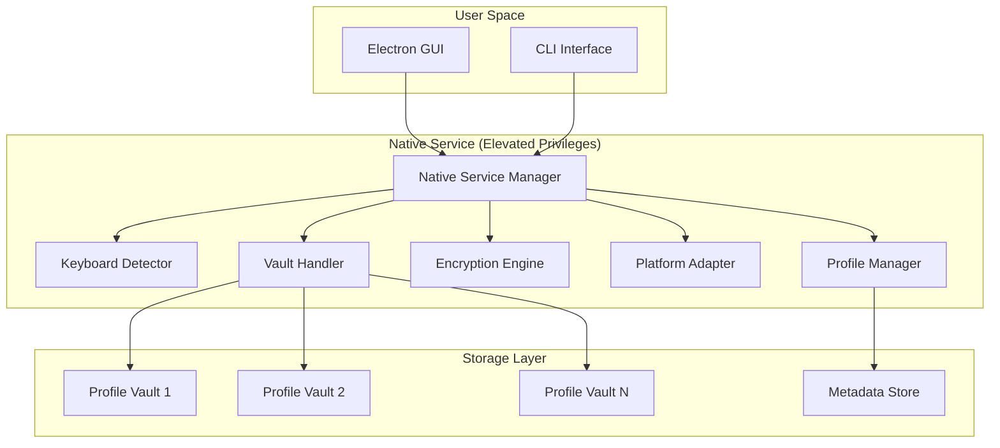

# Real Folder Encryption - Design Document

## Overview

This design implements genuine AES-256 folder encryption for PhantomVault's multi-profile system, replacing the current fake encryption with real cryptographic protection. The system provides complete folder hiding, multi-profile isolation, system-wide keyboard detection, and platform-specific unlock mechanisms while maintaining the existing service architecture.

## Architecture

### High-Level Architecture



### Service Integration

The design extends the existing PhantomVault service architecture:
- Maintains current HTTP API for GUI communication
- Adds new encryption endpoints to existing IPC server
- Integrates with existing profile management system
- Preserves current service lifecycle management

## Components and Interfaces

### 1. Encryption Engine

**Purpose**: Core cryptographic operations with AES-256 encryption

**Key Classes**:
```cpp
class EncryptionEngine {
public:
    struct EncryptionResult {
        std::vector<uint8_t> encrypted_data;
        std::vector<uint8_t> iv;
        std::vector<uint8_t> salt;
        std::string algorithm;
        bool success;
    };
    
    EncryptionResult encryptFile(const std::string& file_path, 
                                const std::vector<uint8_t>& key);
    bool decryptFile(const std::string& encrypted_path, 
                    const std::string& output_path,
                    const std::vector<uint8_t>& key,
                    const std::vector<uint8_t>& iv);
    std::vector<uint8_t> deriveKey(const std::string& password, 
                                  const std::vector<uint8_t>& salt);
};
```

**Integration**: Extends existing `folder_security_manager.cpp` with real encryption instead of marker files.

### 2. Profile Vault System

**Purpose**: Multi-profile encrypted storage with complete isolation

**Key Classes**:
```cpp
class ProfileVault {
private:
    std::string profile_id;
    std::string vault_path;
    std::vector<uint8_t> master_key_hash;
    
public:
    bool lockFolder(const std::string& folder_path);
    bool unlockFolder(const std::string& folder_path, UnlockMode mode);
    std::vector<std::string> getLockedFolders();
    bool isValidMasterKey(const std::string& master_key);
};

enum class UnlockMode {
    TEMPORARY,  // Auto-lock on system events
    PERMANENT   // Remove from vault tracking
};
```

**Integration**: Enhances existing `profile_manager.cpp` with vault-specific operations and encryption key management.

### 3. Enhanced Keyboard Detection

**Purpose**: System-wide keyboard monitoring with master key sequence detection

**Key Classes**:
```cpp
class KeyboardSequenceDetector {
private:
    std::map<std::string, std::string> profile_sequences;
    bool monitoring_active;
    
public:
    void registerSequence(const std::string& profile_id, 
                         const std::string& sequence);
    void startMonitoring();
    void stopMonitoring();
    
private:
    void onSequenceDetected(const std::string& profile_id);
    void handlePlatformSpecificInput();
};
```

**Integration**: Replaces fake keyboard detection in `keyboard_sequence_detector.cpp` with real X11/platform-specific monitoring.

### 4. Platform Adapter

**Purpose**: Platform-specific capabilities and fallback unlock mechanisms

**Key Classes**:
```cpp
class PlatformAdapter {
public:
    struct PlatformCapabilities {
        bool supports_keyboard_monitoring;
        bool supports_notifications;
        bool supports_context_menus;
        bool requires_elevated_privileges;
    };
    
    PlatformCapabilities detectCapabilities();
    bool requestMasterKeyViaNotification(const std::string& profile_id);
    bool requestMasterKeyViaContextMenu(const std::string& vault_path);
    bool elevatePrivileges();
};
```

**Integration**: New component that works with existing service manager to provide platform-specific functionality.

### 5. Vault Handler

**Purpose**: File system operations for folder hiding and vault management

**Key Classes**:
```cpp
class VaultHandler {
public:
    bool hideFolder(const std::string& folder_path);
    bool restoreFolder(const std::string& folder_path, 
                      const std::string& original_path);
    bool createVaultStructure(const std::string& profile_id);
    std::string getVaultPath(const std::string& profile_id);
    
private:
    bool requiresElevatedPrivileges();
    void enforceAdminAccess();
};
```

**Integration**: Extends existing folder security manager with real hiding capabilities using platform-specific mechanisms.

## Data Models

### Profile Vault Structure

```
~/.phantomvault/vaults/
├── profile_1/
│   ├── metadata.json          # Profile info, recovery key hash
│   ├── folders/
│   │   ├── folder_1_hash/
│   │   │   ├── metadata.json  # Original path, permissions, timestamps
│   │   │   └── encrypted_files/
│   │   │       ├── file1.enc
│   │   │       └── file2.enc
│   │   └── folder_2_hash/
│   └── temp_unlock/           # Temporary unlock tracking
└── profile_2/
    └── ...
```

### Encryption Metadata Format

```json
{
  "algorithm": "AES-256-CBC",
  "iv": "base64_encoded_iv",
  "salt": "base64_encoded_salt",
  "iterations": 100000,
  "original_path": "/path/to/original/file",
  "original_permissions": "0644",
  "original_timestamps": {
    "created": "2024-01-01T00:00:00Z",
    "modified": "2024-01-01T00:00:00Z",
    "accessed": "2024-01-01T00:00:00Z"
  },
  "file_size": 1024,
  "checksum": "sha256_hash"
}
```

### Profile Configuration

```json
{
  "profile_id": "uuid",
  "profile_name": "Work Profile",
  "master_key_hash": "pbkdf2_hash",
  "recovery_key_hash": "pbkdf2_hash",
  "salt": "base64_encoded_salt",
  "created_timestamp": "2024-01-01T00:00:00Z",
  "last_accessed": "2024-01-01T00:00:00Z",
  "keyboard_sequence_hash": "hashed_sequence",
  "locked_folders": [
    {
      "original_path": "/path/to/folder",
      "vault_location": "folder_hash",
      "lock_timestamp": "2024-01-01T00:00:00Z"
    }
  ]
}
```

## Error Handling

### Encryption Operation Failures

1. **File Access Errors**: Maintain original files until encryption verification
2. **Insufficient Privileges**: Graceful degradation with user notification
3. **Disk Space Issues**: Pre-flight checks and cleanup procedures
4. **Corruption Detection**: Integrity verification and recovery mechanisms

### Profile Management Errors

1. **Authentication Failures**: Rate limiting and secure error messages
2. **Profile Conflicts**: UUID-based identification and conflict resolution
3. **Key Derivation Errors**: Fallback mechanisms and error reporting
4. **Cross-Profile Access**: Strict isolation enforcement and audit logging

### Platform-Specific Error Handling

```cpp
class ErrorHandler {
public:
    enum class ErrorType {
        ENCRYPTION_FAILED,
        AUTHENTICATION_FAILED,
        PRIVILEGE_INSUFFICIENT,
        PLATFORM_UNSUPPORTED,
        VAULT_CORRUPTED
    };
    
    void handleError(ErrorType type, const std::string& context);
    bool attemptRecovery(ErrorType type, const std::string& profile_id);
    void logSecurityEvent(const std::string& event, const std::string& profile_id);
};
```

## Testing Strategy

### Unit Testing

1. **Encryption Engine Tests**
   - AES-256 encryption/decryption correctness
   - Key derivation function validation
   - IV generation and uniqueness
   - Large file handling and memory management

2. **Profile Management Tests**
   - Profile isolation verification
   - Master key authentication
   - Recovery key generation and validation
   - Cross-profile access prevention

3. **Platform Adapter Tests**
   - Capability detection accuracy
   - Fallback mechanism functionality
   - Privilege elevation handling
   - Platform-specific unlock methods

### Integration Testing

1. **Service Integration**
   - HTTP API endpoint functionality
   - IPC communication with GUI
   - Service lifecycle management
   - Privilege escalation workflows

2. **File System Operations**
   - Folder hiding and restoration
   - Vault structure creation and management
   - Metadata persistence and retrieval
   - Temporary unlock state management

### Security Testing

1. **Cryptographic Validation**
   - FIPS compliance verification
   - Key strength and randomness testing
   - Authenticated encryption validation
   - Side-channel attack resistance

2. **Access Control Testing**
   - Privilege bypass attempts
   - Profile isolation verification
   - Unauthorized access prevention
   - Recovery key security validation

### Performance Testing

1. **Encryption Performance**
   - Large file encryption benchmarks
   - Memory usage optimization
   - Concurrent operation handling
   - System resource impact assessment

2. **Keyboard Detection Performance**
   - System-wide monitoring overhead
   - Response time measurements
   - CPU usage optimization
   - Battery impact on mobile platforms

## Implementation Notes

### Existing Code Integration

The design preserves the current PhantomVault architecture:

1. **Service Manager**: Extend existing service with encryption capabilities
2. **IPC Server**: Add new endpoints for vault operations
3. **Profile Manager**: Enhance with vault-specific profile data
4. **GUI Components**: Update to support new encryption features

### Security Considerations

1. **Memory Management**: Secure memory allocation for cryptographic keys
2. **Key Storage**: Never store master keys in plaintext
3. **Audit Logging**: Comprehensive security event logging
4. **Privilege Minimization**: Use elevated privileges only when necessary

### Platform-Specific Implementation

1. **Linux**: X11 keyboard monitoring, sudo privilege management
2. **macOS**: Accessibility API integration, admin privilege handling
3. **Windows**: Low-level keyboard hooks, UAC integration

### Migration Strategy

For existing PhantomVault installations:

1. **Detection**: Identify existing marker-file "encrypted" folders
2. **Migration**: Offer to convert to real encryption
3. **Backup**: Create backups before migration
4. **Verification**: Validate successful migration and cleanup