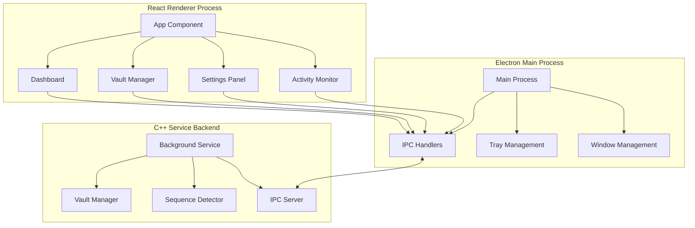
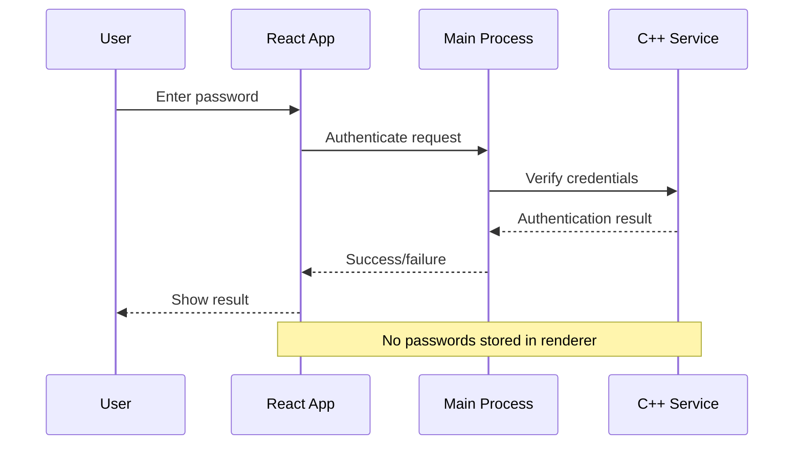

# GUI Vault Management System Design

## Overview

The GUI Vault Management System provides a comprehensive React-based Electron interface for managing PhantomVault encrypted storage. The system builds upon the existing C++ service backend and implements a modern, user-friendly interface for vault operations, monitoring, and configuration.

## Architecture

### High-Level Architecture



### Component Architecture

The GUI system follows a modular React component architecture with clear separation of concerns:

1. **Main Dashboard**: Central hub showing vault status and quick actions
2. **Vault Manager**: Detailed vault configuration and management interface
3. **Activity Monitor**: Real-time logging and monitoring display
4. **Settings Panel**: Application and vault configuration
5. **Status Bar**: System tray integration and notifications

## Components and Interfaces

### Core React Components

#### 1. VaultDashboard Component
```typescript
interface VaultDashboardProps {
  vaults: VaultInfo[];
  onVaultAction: (action: VaultAction) => void;
  refreshInterval?: number;
}

interface VaultInfo {
  id: string;
  name: string;
  path: string;
  status: 'mounted' | 'unmounted' | 'error' | 'loading';
  lastAccess: Date;
  size: number;
  folderCount: number;
}
```

#### 2. VaultCreationWizard Component
```typescript
interface VaultCreationWizardProps {
  onComplete: (config: VaultConfig) => void;
  onCancel: () => void;
}

interface VaultConfig {
  name: string;
  path: string;
  password: string;
  keyboardSequence: string;
  autoMount: boolean;
  encryptionLevel: 'standard' | 'high';
}
```

#### 3. VaultEditor Component
```typescript
interface VaultEditorProps {
  vault: VaultInfo;
  onSave: (config: VaultConfig) => void;
  onCancel: () => void;
  readOnly?: boolean;
}
```

#### 4. ActivityMonitor Component
```typescript
interface ActivityMonitorProps {
  maxEntries?: number;
  filterLevel?: LogLevel;
  autoScroll?: boolean;
}

interface LogEntry {
  timestamp: Date;
  level: LogLevel;
  source: string;
  message: string;
  vaultId?: string;
}
```

### IPC Communication Layer

#### IPC Message Types
```typescript
enum IPCMessageType {
  // Vault Operations
  GET_VAULT_LIST = 'get-vault-list',
  CREATE_VAULT = 'create-vault',
  MOUNT_VAULT = 'mount-vault',
  UNMOUNT_VAULT = 'unmount-vault',
  DELETE_VAULT = 'delete-vault',
  
  // Configuration
  GET_SETTINGS = 'get-settings',
  UPDATE_SETTINGS = 'update-settings',
  
  // Monitoring
  GET_ACTIVITY_LOG = 'get-activity-log',
  SUBSCRIBE_ACTIVITY = 'subscribe-activity',
  
  // Status Updates
  VAULT_STATUS_CHANGED = 'vault-status-changed',
  ACTIVITY_LOG_ENTRY = 'activity-log-entry',
  ERROR_NOTIFICATION = 'error-notification'
}
```

#### IPC Handler Interface
```typescript
interface IPCHandlers {
  // Vault management
  handleGetVaultList(): Promise<VaultInfo[]>;
  handleCreateVault(config: VaultConfig): Promise<VaultOperationResult>;
  handleMountVault(vaultId: string, password?: string): Promise<VaultOperationResult>;
  handleUnmountVault(vaultId: string): Promise<VaultOperationResult>;
  
  // Settings management
  handleGetSettings(): Promise<AppSettings>;
  handleUpdateSettings(settings: Partial<AppSettings>): Promise<void>;
  
  // Activity monitoring
  handleGetActivityLog(filter?: LogFilter): Promise<LogEntry[]>;
  handleSubscribeActivity(callback: (entry: LogEntry) => void): () => void;
}
```

### State Management

#### Application State Structure
```typescript
interface AppState {
  // Authentication
  isAuthenticated: boolean;
  currentProfile: VaultProfile | null;
  
  // Vault data
  vaults: VaultInfo[];
  selectedVault: string | null;
  
  // UI state
  activeView: 'dashboard' | 'vaults' | 'activity' | 'settings';
  isLoading: boolean;
  notifications: Notification[];
  
  // Settings
  settings: AppSettings;
  
  // Activity monitoring
  activityLog: LogEntry[];
  activityFilter: LogFilter;
}
```

#### State Management Pattern
- Use React Context for global state management
- Implement custom hooks for vault operations
- Use React Query for server state synchronization
- Local state for UI-specific data

## Data Models

### Vault Configuration Model
```typescript
interface VaultProfile {
  id: string;
  name: string;
  createdAt: Date;
  lastModified: Date;
  isActive: boolean;
}

interface VaultFolder {
  id: string;
  profileId: string;
  name: string;
  originalPath: string;
  encryptedPath: string;
  isLocked: boolean;
  keyboardSequence: string;
  autoLock: boolean;
  lockTimeout: number; // minutes
}
```

### Application Settings Model
```typescript
interface AppSettings {
  // General
  autoStart: boolean;
  minimizeToTray: boolean;
  closeToTray: boolean;
  
  // Security
  autoLockTimeout: number; // minutes
  requirePasswordConfirmation: boolean;
  clearClipboardTimeout: number; // seconds
  
  // UI
  theme: 'light' | 'dark' | 'system';
  language: string;
  showNotifications: boolean;
  
  // Monitoring
  enableActivityLogging: boolean;
  maxLogEntries: number;
  logLevel: LogLevel;
}
```

### Operation Result Models
```typescript
interface VaultOperationResult {
  success: boolean;
  message: string;
  vaultId?: string;
  error?: string;
  details?: Record<string, any>;
}

interface BulkOperationResult {
  totalCount: number;
  successCount: number;
  failedCount: number;
  results: VaultOperationResult[];
}
```

## Error Handling

### Error Categories
1. **Network/IPC Errors**: Communication failures with C++ service
2. **Validation Errors**: Invalid user input or configuration
3. **System Errors**: File system, permissions, or OS-level issues
4. **Security Errors**: Authentication failures or security violations

### Error Handling Strategy
```typescript
interface ErrorHandler {
  handleIPCError(error: IPCError): void;
  handleValidationError(error: ValidationError): void;
  handleSystemError(error: SystemError): void;
  handleSecurityError(error: SecurityError): void;
}

class GlobalErrorHandler implements ErrorHandler {
  // Centralized error handling with user notifications
  // Automatic retry logic for transient errors
  // Error reporting and logging
}
```

### User Feedback System
- Toast notifications for quick feedback
- Modal dialogs for critical errors
- Progress indicators for long operations
- Status indicators in the system tray

## Testing Strategy

### Unit Testing
- **Component Testing**: React Testing Library for component behavior
- **Hook Testing**: Custom hooks with mock IPC layer
- **Utility Testing**: Pure functions and data transformations

### Integration Testing
- **IPC Communication**: Mock C++ service responses
- **State Management**: Context and reducer testing
- **User Workflows**: End-to-end component interactions

### E2E Testing
- **Electron Testing**: Spectron or Playwright for full app testing
- **Cross-Platform**: Windows, macOS, and Linux compatibility
- **Performance Testing**: Memory usage and responsiveness

### Testing Infrastructure
```typescript
// Mock IPC layer for testing
interface MockIPCLayer {
  mockVaultList(vaults: VaultInfo[]): void;
  mockVaultOperation(result: VaultOperationResult): void;
  simulateError(error: IPCError): void;
  simulateNetworkDelay(ms: number): void;
}

// Test utilities
interface TestUtils {
  renderWithProviders(component: ReactElement): RenderResult;
  createMockVault(overrides?: Partial<VaultInfo>): VaultInfo;
  waitForVaultOperation(): Promise<void>;
}
```

## Security Considerations

### Data Protection
- No sensitive data stored in renderer process memory
- Secure IPC communication with message validation
- Automatic memory cleanup for password fields
- Encrypted local storage for non-sensitive settings

### UI Security
- Input sanitization for all user inputs
- XSS protection in dynamic content rendering
- Secure handling of file paths and system commands
- Rate limiting for vault operations

### Authentication Flow


## Performance Optimization

### Rendering Performance
- React.memo for expensive components
- useMemo and useCallback for computed values
- Virtual scrolling for large activity logs
- Debounced search and filtering

### Memory Management
- Cleanup event listeners on unmount
- Limit activity log entries in memory
- Efficient state updates with immer
- Lazy loading for non-critical components

### IPC Optimization
- Batch multiple operations when possible
- Cache frequently accessed data
- Implement request deduplication
- Use streaming for large data transfers

## Accessibility

### WCAG 2.1 Compliance
- Keyboard navigation for all interactive elements
- Screen reader support with proper ARIA labels
- High contrast mode support
- Focus management for modal dialogs

### Internationalization
- React-i18next for translation management
- RTL language support
- Locale-specific date/time formatting
- Accessible text alternatives for icons

## Development Guidelines

### Code Organization
```
src/
├── components/
│   ├── dashboard/
│   ├── vault-manager/
│   ├── activity-monitor/
│   ├── settings/
│   └── common/
├── hooks/
├── services/
├── types/
├── utils/
└── styles/
```

### Component Standards
- TypeScript for all components
- Consistent prop interfaces
- Error boundaries for fault isolation
- Comprehensive JSDoc documentation

### State Management Rules
- Single source of truth for vault data
- Immutable state updates
- Clear action naming conventions
- Proper error state handling